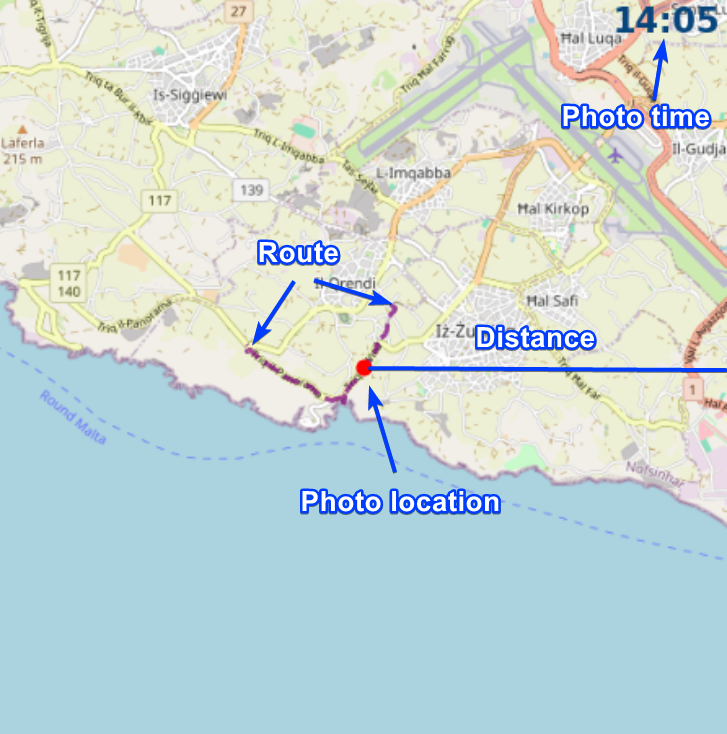

## About
This is a script that will generate and overlay a minimap of the photos location. \
This is the given example


if you use the --overlay false only the map will exported, this is that with some explanations 

## Install
Clone this repository and install the necessary packages using
```
pip install -r requirements.txt
```
## Usage
Simply call it and pass the photos directory or a single photo.
```
python main.py "path/to/photo/directory"
```
If you cloned this repo you can try out the example
```
python main.py "./test/Example.jpg"  --trip_route ./test/example.csv
```
You can always run the help command. It will also show all of the customization features
```
python main.py --help
```
It may have bugs as it was not extensively tested. Use it at your own risk
